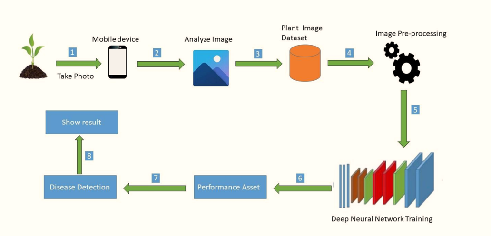
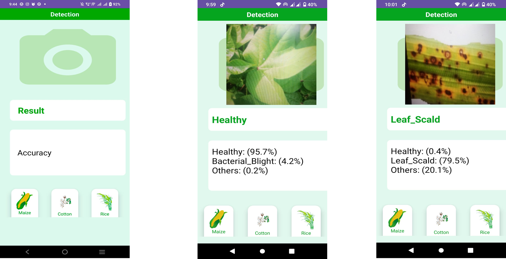
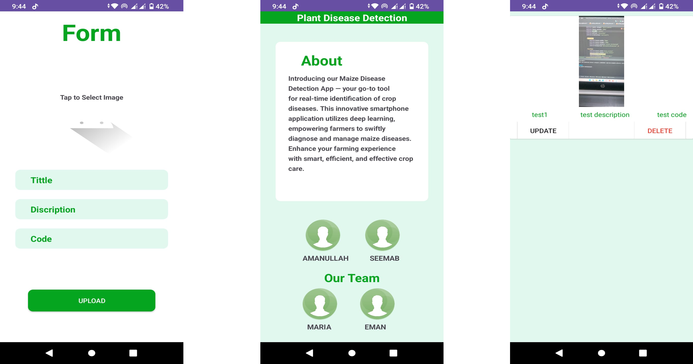
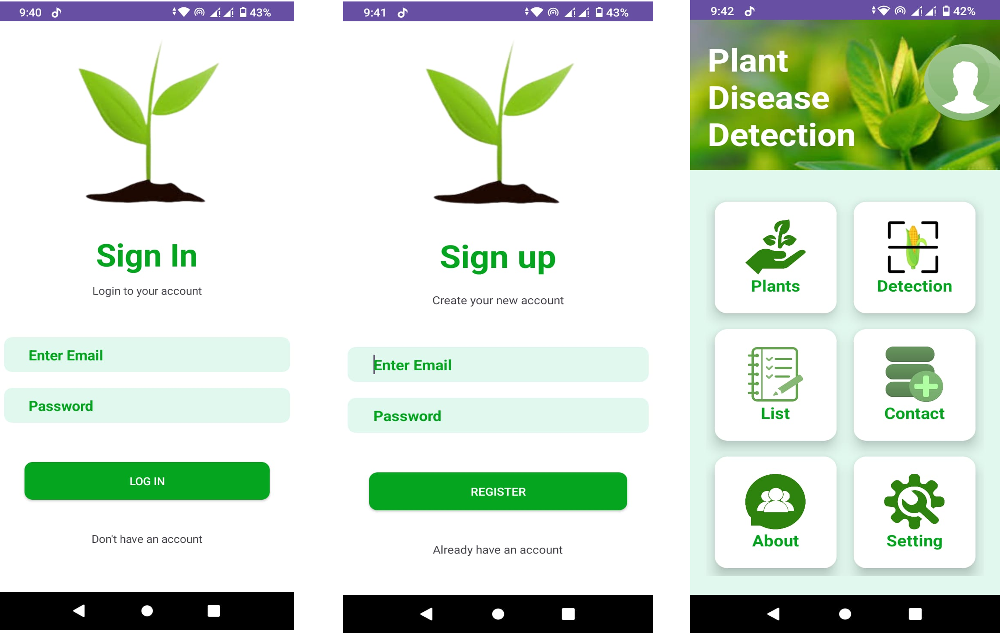

# Real-Time Maize Disease Detection App 🌽📱

This project is a **deep learning-based smartphone application** designed to help farmers detect maize crop diseases in real-time. The app leverages advanced convolutional neural networks (CNNs) to identify common maize diseases from plant images with high accuracy, empowering users to take timely actions to save their crops.

## Key Features 🚀
- **Real-Time Disease Detection**: Instantly diagnose maize crop diseases using your smartphone's camera.
- **Deep Learning-Powered**: Built using state-of-the-art CNN models for accurate and reliable disease classification.
- **User-Friendly Interface**: Simple and intuitive design, tailored for farmers with minimal technical knowledge.
- **Offline Functionality**: Works without internet connectivity for rural areas with limited network access.
- **Comprehensive Database**: Trained on a diverse dataset of maize disease images to cover multiple conditions.

## Project Objectives 🎯
1. Provide farmers with an affordable and accessible tool for early detection of maize crop diseases.
2. Minimize crop losses by enabling prompt disease diagnosis and intervention.
3. Promote the use of AI and mobile technology in the agriculture sector.

## How It Works 🛠️
1. Capture a photo of the maize plant leaf using the app.
2. The app processes the image using a pre-trained deep learning model.
3. Disease classification results are displayed in real-time, along with treatment suggestions.

## Technologies Used 🖥️
- **Programming Language**: Python (for deep learning model) and Java/Kotlin (for Android app development)
- **Frameworks**: TensorFlow/Keras for deep learning
- **Mobile Development**: Android Studio
- **Dataset**: Curated maize disease dataset with labeled images for training and testing
  
## System Architecture 🏗️
The system architecture of the maize disease detection app is shown below:

-
## Why This Project? 🌍
Maize is one of the most widely cultivated crops globally and a key source of food and income for millions of farmers. Early detection and treatment of diseases like blight, rust, and leaf spot can prevent significant crop losses, ensuring food security and improving farmers' livelihoods. This app bridges the gap between cutting-edge AI technology and grassroots agricultural needs.
## Screenshots 📸

-

## Contributing 🤝
Contributions, issues, and feature requests are welcome!

## Acknowledgements 🙌
- The farmers and agricultural experts who provided valuable feedback during the testing phase.
- Open-source contributors and researchers whose work inspired this project.

## Installation 🛠️
Contact with me
